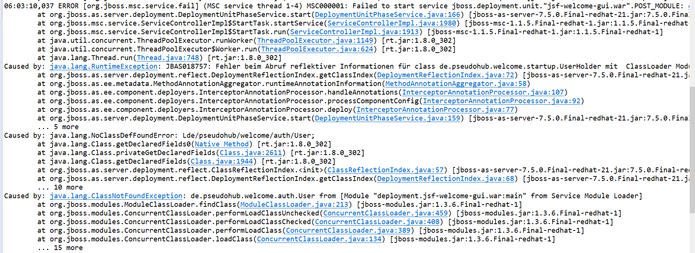
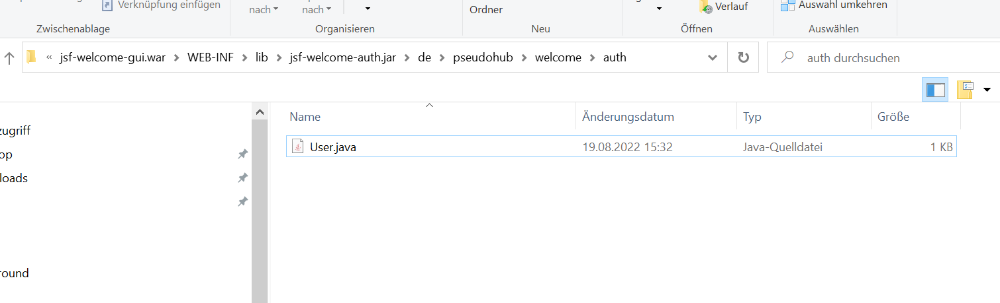

#Steps to reproduce the issue from [Dependant project does not compile into war project](https://stackoverflow.com/questions/73399193/gradle-doesnt-compile-dependant-library-project-in-war-project)

1. Download [Eclipse EE](https://www.eclipse.org/downloads/packages/release/2019-12/r)
2. Download JBoss 6.4 from the following link [JBoss 6.4 Download](https://developers.redhat.com/content-gateway/file/jboss-eap-6.4.0.GA.zip)
3. Download [Amazon Corretto 8](https://docs.aws.amazon.com/corretto/latest/corretto-8-ug/downloads-list.html)
4. Add the JBoss 6.4 to the servers view in eclipse
5. Clone this repository
6. Add the jsf-welcome-gui project to the jboss server

I am getting the exception 

The problem is that the dependant java-library project is not compiled in the $JBOSS_HOME$/standalone/deployment/jsf-welcome-gui.war/WEB-INF/lib/jsf-welcome-auth.jar

